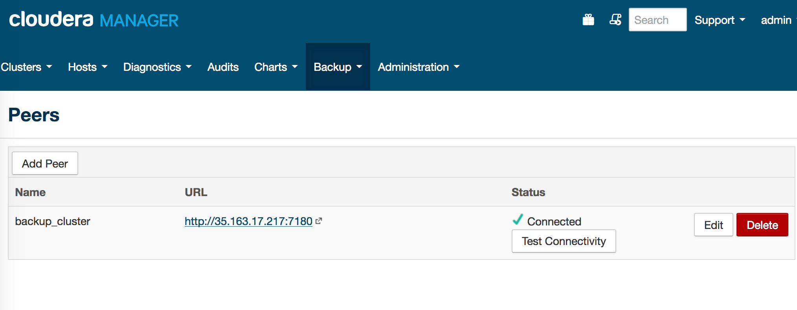
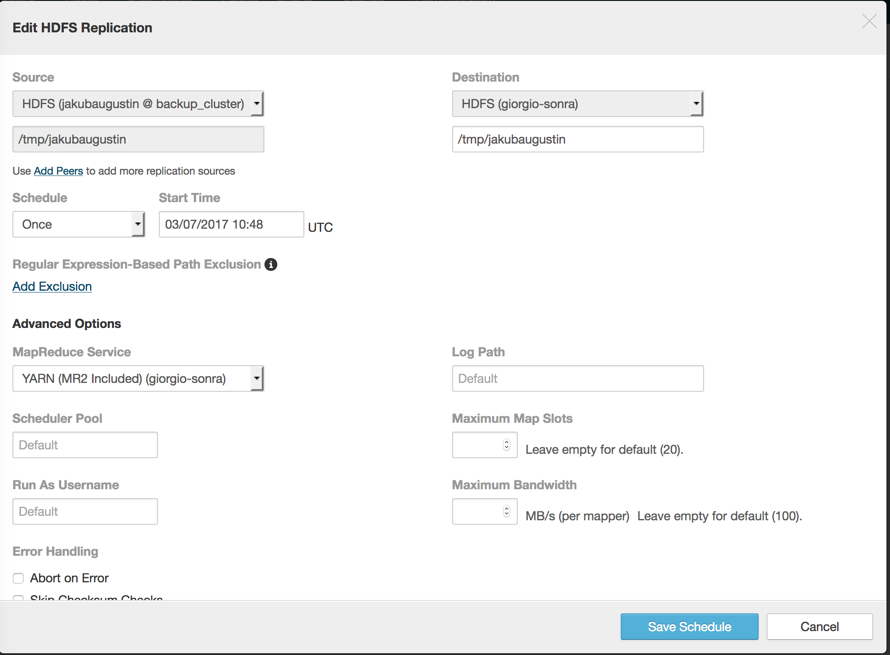
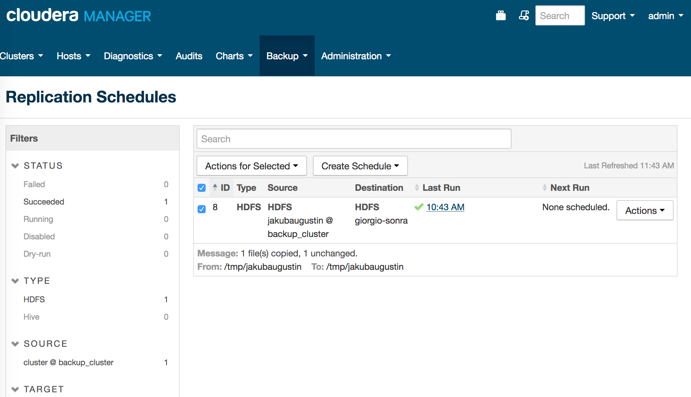

# HDFS Lab: Replicate to another cluster

Node: Data replication in the cloud depends on peers that can see each other's nodes.

## 1. Choose a partner in class
> jakubaugustin


## 2. Name a source directory after your GitHub handle
> /tmp/jakubaugustin


## 3. Name a target directory after your partner's GitHub handle
> /tmp/giorgio-sonra

### 3.1. Testing user
```
$ sudo useradd giorgio-sonra
$ sudo -u hdfs hdfs -mkdir /user/giorgio-sonra
$ sudo -u hdfs hdfs dfs -chown giorgio-sonra /user/giorgio-sonra
```

## 4. Use teragen to create a 500 MB file

```
$ time sudo -u giorgio-sonra yarn jar /opt/cloudera/parcels/CDH/lib/hadoop-mapreduce/hadoop-mapreduce-examples.jar teragen -Dmapred.map.task=1 5000000 /tmp/giorgio-sonra/teragen

```

## 5. Copy your partner's file to your target directory
   Let one partner use distCp on the command line
   Let the other use BDR

> Cloudera Manager => Backup => Peer



> Cloudera Manager => Backup => Replication Schedules






## 6. Browse the results
   Use hdfs fsck <path> -files -blocks on your source and target directories
   Copy the work for this lab into storage/labs/0_replication.md

```
$ sudo -u hdfs hdfs fsck /tmp/jakubaugustin -files -blocks
Connecting to namenode via http://n2.localdomain:50070
FSCK started by hdfs (auth:SIMPLE) from /172.31.39.128 for path /tmp/jakubaugustin at Tue Mar 07 12:20:47 UTC 2017
/tmp/jakubaugustin <dir>
/tmp/jakubaugustin/teragen <dir>
/tmp/jakubaugustin/teragen/.distcp.tmp.1688263687342216707 0 bytes, 0 block(s):  OK

/tmp/jakubaugustin/teragen/.distcp.tmp.6337801564348029682 0 bytes, 0 block(s):  OK

/tmp/jakubaugustin/teragen/_SUCCESS 0 bytes, 0 block(s):  OK

/tmp/jakubaugustin/teragen/part-m-00000 500000000 bytes, 4 block(s):  OK
0. BP-1242060541-172.31.34.172-1488850207067:blk_1073741903_1079 len=134217728 Live_repl=3
1. BP-1242060541-172.31.34.172-1488850207067:blk_1073741904_1080 len=134217728 Live_repl=3
2. BP-1242060541-172.31.34.172-1488850207067:blk_1073741905_1081 len=134217728 Live_repl=3
3. BP-1242060541-172.31.34.172-1488850207067:blk_1073741906_1082 len=97346816 Live_repl=3

Status: HEALTHY
 Total size:	500000000 B
 Total dirs:	2
 Total files:	4
 Total symlinks:		0
 Total blocks (validated):	4 (avg. block size 125000000 B)
 Minimally replicated blocks:	4 (100.0 %)
 Over-replicated blocks:	0 (0.0 %)
 Under-replicated blocks:	0 (0.0 %)
 Mis-replicated blocks:		0 (0.0 %)
 Default replication factor:	3
 Average block replication:	3.0
 Corrupt blocks:		0
 Missing replicas:		0 (0.0 %)
 Number of data-nodes:		3
 Number of racks:		1
FSCK ended at Tue Mar 07 12:20:47 UTC 2017 in 2 milliseconds
```

```
The filesystem under path '/tmp/jakubaugustin' is HEALTHY
$ sudo -u hdfs hdfs fsck /tmp/giorgio-sonra -files -blocks
Connecting to namenode via http://n2.localdomain:50070
FSCK started by hdfs (auth:SIMPLE) from /172.31.39.128 for path /tmp/giorgio-sonra at Tue Mar 07 12:20:59 UTC 2017
/tmp/giorgio-sonra <dir>
/tmp/giorgio-sonra/teragen <dir>
/tmp/giorgio-sonra/teragen/_SUCCESS 0 bytes, 0 block(s):  OK

/tmp/giorgio-sonra/teragen/part-m-00000 500000000 bytes, 4 block(s):  OK
0. BP-1242060541-172.31.34.172-1488850207067:blk_1073741825_1001 len=134217728 Live_repl=3
1. BP-1242060541-172.31.34.172-1488850207067:blk_1073741826_1002 len=134217728 Live_repl=3
2. BP-1242060541-172.31.34.172-1488850207067:blk_1073741827_1003 len=134217728 Live_repl=3
3. BP-1242060541-172.31.34.172-1488850207067:blk_1073741828_1004 len=97346816 Live_repl=3

Status: HEALTHY
 Total size:	500000000 B
 Total dirs:	2
 Total files:	2
 Total symlinks:		0
 Total blocks (validated):	4 (avg. block size 125000000 B)
 Minimally replicated blocks:	4 (100.0 %)
 Over-replicated blocks:	0 (0.0 %)
 Under-replicated blocks:	0 (0.0 %)
 Mis-replicated blocks:		0 (0.0 %)
 Default replication factor:	3
 Average block replication:	3.0
 Corrupt blocks:		0
 Missing replicas:		0 (0.0 %)
 Number of data-nodes:		3
 Number of racks:		1
FSCK ended at Tue Mar 07 12:20:59 UTC 2017 in 1 milliseconds


The filesystem under path '/tmp/giorgio-sonra' is HEALTHY
```

## 7. Troubleshooting

### 7.1. New external cluster IPs

In case the clusters are far each other, they don't have the internal IP access.

Included the external IPs and hostnames from another cluster in the all nodes (n1-n5)

> /etc/hosts

### 7.2. Enabling the HDFS hostname resolving

The default behaviour seems getting the IPs (private) instead of hostnames

>  Cloudera Manager => Clusters => HDFS =>  Configuration

Enable these parameters below and them restart the cluster

* Bind DataNode to Wildcard Address
* Bind NameNode to Wildcard Address
* Use DataNode Hostname (dfs.client.use.datanode.hostname)
* Use DataNode Hostname (dfs.datanode.use.datanode.hostname)
